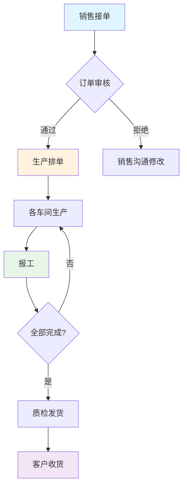

# 第1章：项目规划与需求分析

## 教学目标

1. 理解软件开发中需求分析的重要性
2. 掌握与客户沟通需求的技巧
3. 能够绘制业务流程图
4. 能够编写需求规格说明书

---

## 1.1 真实案例导入

### 案例背景

**华丰电梯生产有限公司**是一家电梯制造企业，主要生产各类电梯产品。

**当前痛点**：
1. 客户信息不透明，销售各自维护客户信息
2. 沟通散乱，靠微信/电话，无记录
3. 发货预期错误，销售随便承诺，未核实工厂产能
4. 排产不透明，客户不知道进度
5. 生产计划评估靠"感性"，交期估算不准确

### 一次事故的损失

| 损失类型 | 金额 |
|---------|------|
| 管理成本（时间损耗） | 3,600元 |
| 生产中断损失 | 4,600元 |
| **合计** | **8,200元+** |

> 这种事故可能每月发生多次，加上客户信任度下降，损失巨大。

---

## 1.2 需求获取与沟通

### 如何与客户沟通？

#### 沟通技巧

1. **多问"为什么"**
   - 不要只听客户说什么，要理解他们真正的问题
   - 例如：客户说"我要一个排单系统" → 问"您希望通过排单解决什么问题？"

2. **引导式提问**
   - "您最困扰的问题是什么？"
   - "如果这个问题解决了，对您的工作有什么帮助？"
   - "目前您是怎么处理这个工作的？"

3. **复述确认**
   - "我理解您的意思是...，对吗？"
   - 避免理解偏差

#### 需求调研问卷模板

```markdown
## 基本信息
- 企业名称：
- 所属行业：
- 企业规模：

## 业务流程
1. 目前的生产流程是怎样的？
2. 有哪些角色参与生产过程？
3. 订单从哪里来？如何流转？

## 痛点分析
1. 目前最困扰的问题是什么？
2. 这个问题多久发生一次？
3. 每次造成多大损失？

## 期望目标
1. 您希望系统实现什么功能？
2. 期望达到什么效果？
3. 有没有预算和时间要求？
```

---

## 1.3 业务流程分析

### 核心角色分析

| 角色 | 职责 | 痛点 |
|-----|------|------|
| 销售 | 接收订单、对接客户 | 不知道生产进度，无法准确回复客户 |
| 生产经理 | 制定生产计划 | 靠经验估算，不准确 |
| 车间主管 | 现场管理 | 信息不透明，难以协调 |
| 工人 | 生产报工 | 报工流程繁琐 |
| 客户 | 等待收货 | 不知道进度，经常催问 |

### 业务流程图



### 核心流程说明

1. **订单管理**：销售录入订单 → 审核确认
2. **生产排单**：根据工艺路线安排生产顺序
3. **报工**：工人完成工序后扫码报工
4. **进度跟踪**：实时更新订单状态
5. **发货**：完成后通知客户

---

## 1.4 需求文档编写

### 需求规格说明书模板

```markdown
# [项目名称] 需求规格说明书

## 一、项目背景

### 1.1 企业简介
[企业基本情况]

### 1.2 项目背景
[为什么需要这个系统]

## 二、业务现状

### 2.1 当前流程
[描述现有业务流程]

### 2.2 存在问题
| 问题 | 影响 | 频率 |
|-----|------|------|
| 问题1 | 影响描述 | 频率 |

## 三、功能需求

### 3.1 功能清单

| 序号 | 功能 | 优先级 | 描述 |
|-----|------|--------|------|
| 1 | 订单管理 | P0 | 订单的增删改查 |
| 2 | 生产排单 | P0 | 安排生产顺序 |
| 3 | 扫码报工 | P0 | 工人扫码报工 |
| 4 | 进度查询 | P1 | 客户查看进度 |

### 3.2 功能详细说明

#### 3.2.1 订单管理

**功能描述**：
[详细描述功能]

**用户故事**：
作为[角色]，我希望[功能]，以便[价值]。

**业务流程**：
[流程图]

**数据需求**：
| 字段 | 类型 | 说明 |
|-----|------|------|
|  |  |  |

**边界情况**：
- [情况1及处理]
- [情况2及处理]

## 四、非功能需求

### 4.1 性能需求
- 页面加载 < 2秒
- 支持 100+ 并发

### 4.2 安全需求
- 数据加密传输
- 权限控制

## 五、验收标准

| 功能 | 验收条件 | 测试方法 |
|-----|---------|---------|
| 订单录入 | 能够正确保存订单 | 手动测试 |
|  |  |  |
```

---

## 1.5 本章实战作业

### 作业1：绘制业务流程图

使用 Mermaid 或 ProcessOn 绘制华丰电梯生产流程图。

### 作业2：编写需求清单

列出你认为生产管理系统应该包含的所有功能，并标注优先级（P0/P1/P2）。

### 作业3：角色分析

分析您所在学校或公司的某个业务流程，列出参与角色及其职责。

---

## 1.6 本章小结

### 知识点回顾

1. **需求沟通技巧** - 多问为什么、引导式提问、复述确认
2. **业务流程图** - 用图形化方式描述流程
3. **需求文档** - 规范化描述需求

### 下一章预告

下一章我们将学习：
- 技术选型
- 项目初始化
- 开发环境搭建

---

## 课后思考

1. 为什么需求分析很重要？如果跳过需求分析会怎样？
2. 需求变更时应该如何处理？
3. 如何判断需求的优先级？
